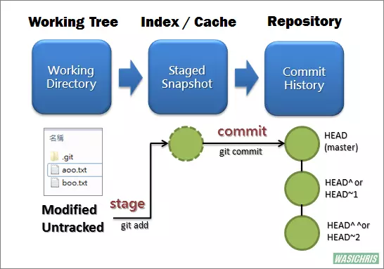

+ Git分为三个区：
1. 工作区（Working Directory）：没有修改或修改后未使用git add的文件
2. 暂存区（Staged）：新增或修改后的文件调用git add后都会被添加到暂存区
3. 提交区（Commit）：所有添加到暂存区里的文件通过git commit之后会被统一添加到提交区，作为一次提交

---
+ HEAD指针指向的是最新的提交节点。而HEAD^代表的是前一次的提交节点。而HEAD~2代表的是前两次的提交节点
1. git reset --soft HEAD^：将最近一次提交节点的提交记录回退到暂存区
   >  如果发现提交记录的commit写错了，那么就可以使用这条指令将本次提交回退到暂存区，再重新把commit补全，进行一次提交
2. git reset --mixed HEAD^：将最近一次提交节点的提交记录回退到工作区
   > 如果发现提交记录里有一个文件多提交了，或者有一个文件漏添加到暂存区而没有在此次提交内，则可以通过这条指令将本次提交都回退到没有添加到暂存区之前，然后再重新add需要提交的文件后再commit
3. git reset --hard HEAD^：将最近一次提交节点的提交记录全部清除
   > 如果此时发现修复一个BUG完全错了，希望取消这次提交，并且把代码回退到没有改动的话，则需要使用这条指令将这次提交全部回退

---
